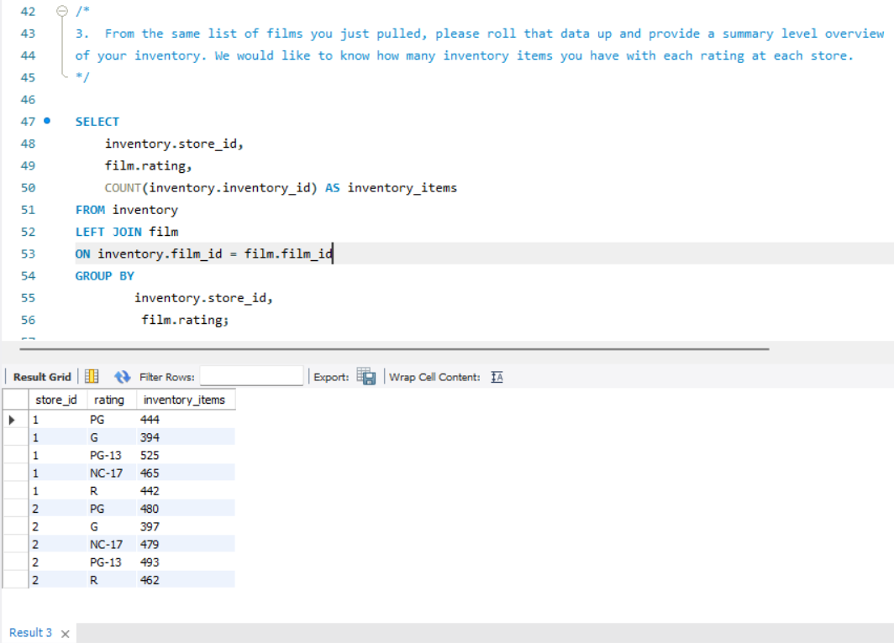
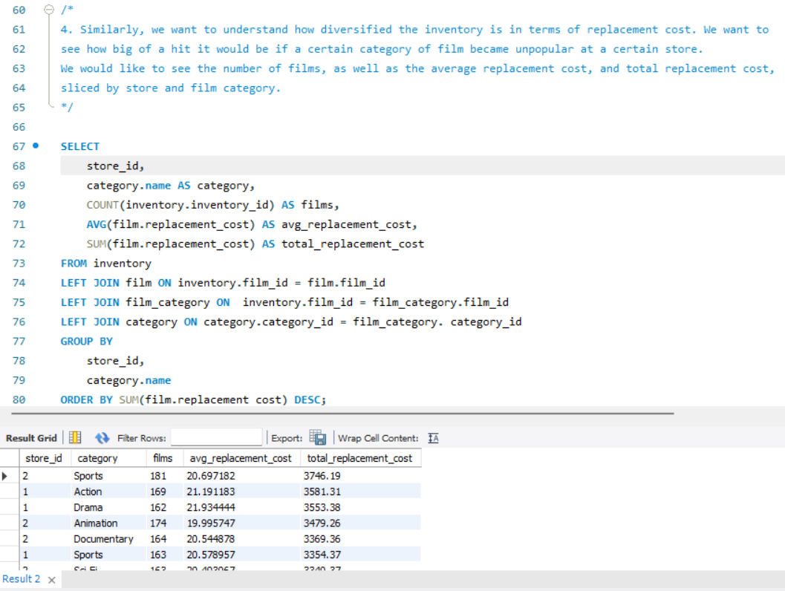
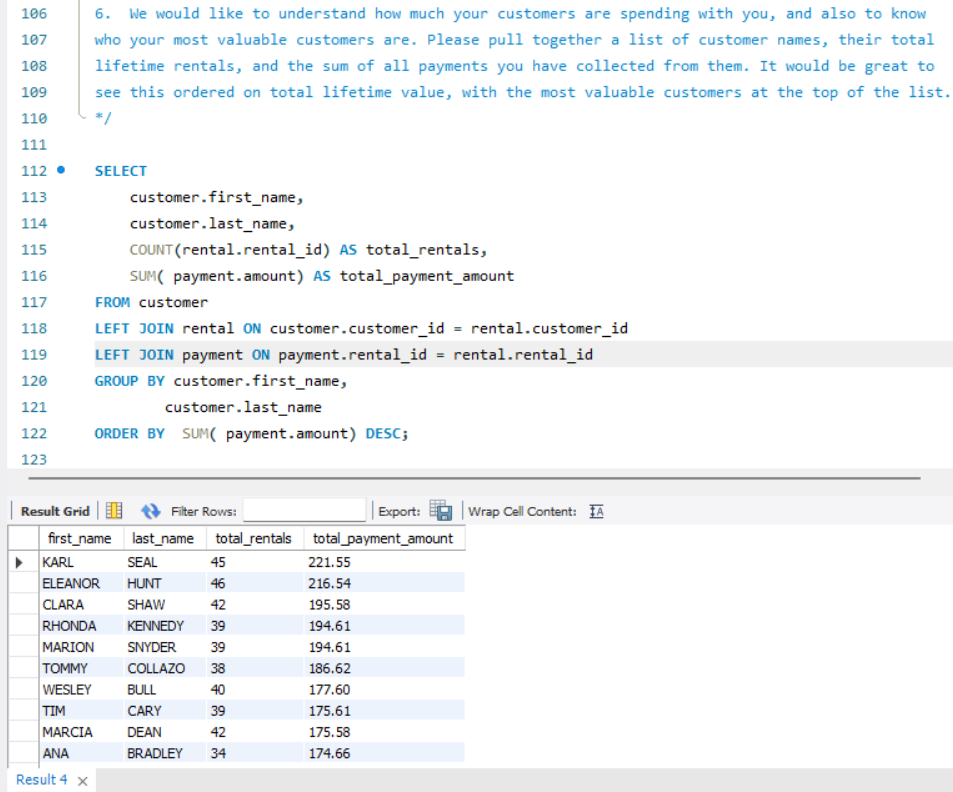

# Maven Movies Business Analysis | MySQL 

## Project Overview:
This project analyzes the Maven Movies relational database using MySQL to answer business questions related to store operations, inventory, customers, financial performance, and business stakeholders. The project focuses on translating stakeholder requirements into SQL queries and structured business analysis. 

## Business Objectives: 
The analysis focuses on: 
- Identifying store managers and locations
- Understanding store-level inventory
- Analyzing inventory by film rating
- Evaluating replacement-cost exposure
- Understanding customer profiles
- Identifying high-value customers
- Combining advisor and investor information

## Tools & Technologies:
- MySQL
- MySQL Workbench
- SQL
- Maven Movies Database

## SQL Skills Demonstrated:
- Multi-table JOINs
- LEFT JOIN
- GROUP BY
- ORDER BY
- Aggregate functions: COUNT, SUM, AVG
- UNION
- Data aggregation
- Customer-level analysis
- Inventory analysis
- Business-oriented SQL querying

## Business Analysis:
**1. Store Managers & Locations** 
Identified store managers and their complete store locations by joining store, staff, address, city, and country data.
**2. Inventory Details**
Retrieved store-level inventory information including film titles, ratings, rental rates, and replacement costs.
**3. Inventory by Rating** 
Analyzed the number of inventory items for each film rating across stores.
**4. Replacement Cost Analysis** 
Analyzed inventory by store and film category, including film counts, average replacement costs, and total replacement-cost exposure.
**5. Customer Analysis** 
Created a customer-level view containing store assignment, active status, and location information.
**6. Customer Lifetime Value**
Calculated total rentals and payment amounts by customer to identify the company's highest-value customers.
**7. Advisors & Investors** 
Combined advisor and investor information into a single dataset using UNION while distinguishing between stakeholder types. 

## Selected Analysis Results: 
**1. Inventory by Rating**
 
**2. Replacement Cost Analysis** 
 
**3. Customer Lifetime Value** 

## Key Insights:
**Inventory by Rating:**
Store 1 has the highest inventory in the PG-13 category with **525 items**, while Store 2 has the highest inventory in the PG category with **480 items**.

**Replacement Cost Analysis:** 
Store 2's Sports category has the highest total replacement cost at **$3,746.19**, representing the largest replacement-cost exposure.

**Customer Lifetime Value:** 
Karl Seal is the highest-value customer, generating **$221.55** in total payments across **45 rentals**.

## 📁 Project Files 
-  'maven_movies_analysis.sql' - Complete SQL analysis 
- `screenshots/` — Selected query results

## Related Training 
This project was completed following SQL training with Maven Analytics.
[[View Maven Analytics Credential]](https://certificates.mavenanalytics.io/b6eba67e-db6e-4597-a130-7ce6cbfaf26d#acc.qF8CPNnU)

## Author 
**Md Rafat Moyeen** 
- [GitHub](https://github.com/Md-Rafat)
- [LinkedIn](https://www.linkedin.com/in/mdrafatm/)

## Find:
[View Maven Analytics Credential](https://certificates.mavenanalytics.io/b6eba67e-db6e-4597-a130-7ce6cbfaf26d#acc.qF8CPNnU)

  
